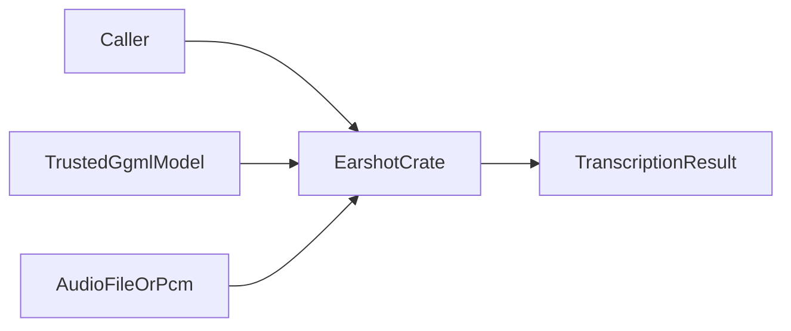
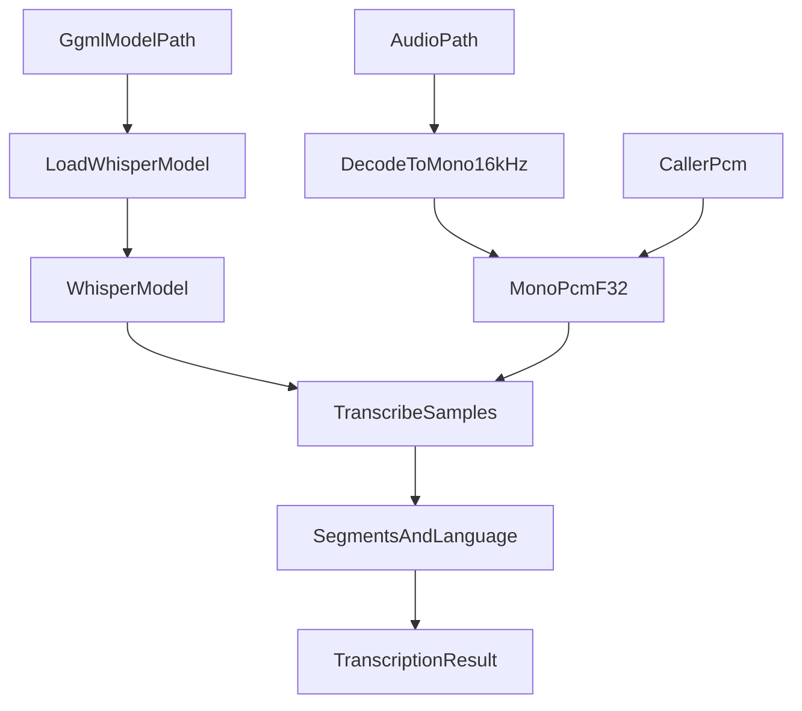
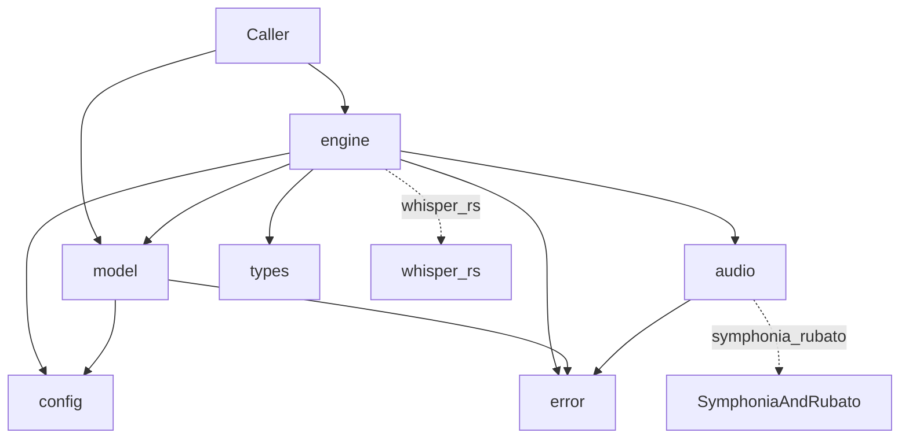
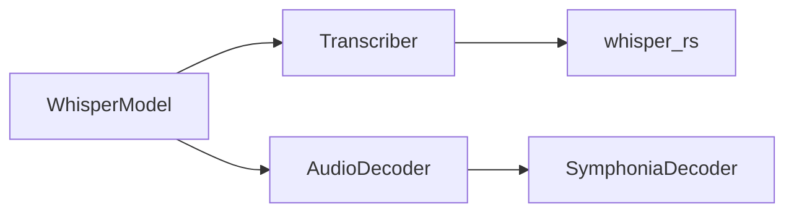

# Earshot architecture

This document gives the high-level system architecture of the Earshot crate.

## Purpose and scope

Earshot turns speech audio into **timed transcript segments** and a detected
**language**.
It loads a GGML Whisper model through whisper.cpp (`whisper-rs`) and decodes
audio with Symphonia (no FFmpeg).

This file covers:

- The crate shape and module map
- The transcription data flow (load → decode → infer → segments)
- Audio decode and model-load boundaries at a high level
- Public API and extension points
- Error contracts at a high level

This file does **not** cover:

- Full usage examples — see [README.md](../../README.md)
- Whisper domain rules — see [whisper-earshot](../skills/whisper-earshot/SKILL.md)
- Decode/resample internals — see [symphonia-decode](../skills/symphonia-decode/SKILL.md)
- CI and local verify parity — see [ci-rust-earshot](../skills/ci-rust-earshot/SKILL.md)

## System context

The caller supplies a **trusted** GGML model path and either an audio file path
or pre-decoded PCM.
The crate returns a [`TranscriptionResult`](../../src/types.rs) with language,
joined text, and timed segments.

Inference uses native whisper.cpp via [`whisper-rs`](https://crates.io/crates/whisper-rs).
Decode and resample use Symphonia and rubato in pure Rust.
FFmpeg is not required.
The optional `cuda` feature enables NVIDIA GPU inference.



## High-level pipeline

A typical file transcription runs these steps:

1. Load the model with [`WhisperModel::load`](../../src/model.rs).
   Validate `ComputeType` against the file’s GGML `model_ftype`.
2. Decode the audio file to mono 16 kHz `f32` PCM with an [`AudioDecoder`](../../src/audio/decoder.rs)
   (default [`SymphoniaDecoder`](../../src/audio/symphonia.rs)), **or** accept
   pre-decoded samples from the caller.
3. Run Whisper through [`Transcriber`](../../src/engine.rs) with
   [`TranscribeConfig`](../../src/config.rs) (language `"auto"` or forced;
   greedy full pass).
4. Collect language and segments into [`TranscriptionResult`](../../src/types.rs).



## Module map

| Module | Role |
| ------ | ---- |
| `lib` | Crate root, re-exports, `#![deny(missing_docs)]` |
| `model` | Load and own `WhisperContext` |
| `engine` | `Transcriber` trait and transcription orchestration |
| `audio` | `AudioDecoder`, `SymphoniaDecoder`, sample-rate constants |
| `config` | `ModelConfig`, `TranscribeConfig`, `Device`, `ComputeType` |
| `types` | `Segment`, `TranscriptionResult` |
| `error` | `Error` and `Result` |



## Audio decode path

Successful decode returns **non-empty** mono `f32` PCM at
[`WHISPER_SAMPLE_RATE`](../../src/audio/decoder.rs) (16_000 Hz).
Empty output is a contract violation.

[`SymphoniaDecoder`](../../src/audio/symphonia.rs) probes the container, selects
an audio track, decodes packets to interleaved PCM, downmixes to mono, and
resamples with rubato `Fft::process_all` (chunking and delay trim built in).
Enabled formats come from Cargo features: MP3, WAV, FLAC, AAC / MP4 / M4A.

[`MAX_AUDIO_DURATION_SECS`](../../src/audio/decoder.rs) (default 2 hours) bounds
decoded length and memory.
Override via `SymphoniaDecoder::max_duration_secs`.

Decoder-level bitstream resets may clear local PCM state and continue.
Format-level resets are rejected as [`Error::UnsupportedBitstreamReset`](../../src/error.rs).

For packet growth, channel resolution, and resampling details, see
[symphonia-decode](../skills/symphonia-decode/SKILL.md).

## Model load and trust

[`WhisperModel`](../../src/model.rs) owns the loaded `WhisperContext`.
GGML model files are parsed by native whisper.cpp code.
Treat the model path as a **trust boundary**.
Corrupt or adversarial files may abort the process (`# Abort` on load).
Only load weights from origins you trust.

[`ModelConfig`](../../src/config.rs) selects:

- [`Device::Cpu`](../../src/config.rs) (default) or `Device::Cuda { device_id }`
  (requires the `cuda` feature; negative `device_id` is invalid)
- [`ComputeType`](../../src/config.rs) — must match the file’s `model_ftype`
  or load returns `ComputeTypeMismatch`

Prefer quantized GGML files (for example `*-q8_0.bin`) with `ComputeType::Int8`.

## Transcription orchestration

[`Transcriber`](../../src/engine.rs) is object-safe (`dyn Transcriber`).

- `transcribe_samples` runs Whisper on mono 16 kHz PCM.
- `transcribe_file_with` decodes through an injected `&dyn AudioDecoder`, then
  transcribes.

[`WhisperModel::transcribe_file`](../../src/engine.rs) is the composition root
for the default decoder: it constructs `SymphoniaDecoder::default()`.
The trait itself does not hard-wire Symphonia (dependency inversion).

Guards before the backend:

- Empty PCM → `InvalidConfig`
- `n_threads < 1` → `InvalidConfig`
- Language strings with null bytes → `InvalidConfig` (whisper-rs would panic)
- Language `None` maps to `"auto"` for detect-then-transcribe
- Do not use whisper.cpp `detect_language(true)` when full transcription is required

After inference, the engine reads the language id, validates segment
centisecond times (end before start, non-monotonic starts), and builds
[`TranscriptionResult`](../../src/types.rs).
Segment text is trimmed; `text` joins non-empty segments with spaces.

## Public surface and extension points

Stable public surface (see [`src/lib.rs`](../../src/lib.rs)):

- `WhisperModel::load`
- `WhisperModel::transcribe_file` / `transcribe_file_with` / `transcribe_samples`
- `Transcriber`
- `AudioDecoder`, `SymphoniaDecoder`, `WHISPER_SAMPLE_RATE`, `MAX_AUDIO_DURATION_SECS`
- `ModelConfig`, `TranscribeConfig`, `Device`, `ComputeType`
- `Segment`, `TranscriptionResult`
- `Error`, `Result`

Extension points:

| Trait / API | Default | Role |
| ----------- | ------- | ---- |
| `AudioDecoder` | `SymphoniaDecoder` | File → mono 16 kHz PCM |
| `Transcriber` | `WhisperModel` | PCM or file → `TranscriptionResult` |
| `transcribe_file_with` | — | Inject a decoder (tests, custom formats) |

The CLI example is [`examples/transcribe.rs`](../../examples/transcribe.rs).



## Errors and contracts

| Variant | When it occurs |
| ------- | -------------- |
| `AudioIo` | Audio path cannot be opened |
| `AudioDecode` | Container/codec failure, missing metadata, resample failure, no samples |
| `UnsupportedBitstreamReset` | Format-level Symphonia reset |
| `AudioTooLong` | Decoded duration exceeds the decoder cap |
| `NoAudioTrack` | No decodable audio track in the file |
| `ModelLoad` | Backend fails to open the GGML file |
| `ComputeTypeMismatch` | Config `ComputeType` ≠ loaded `model_ftype` |
| `Transcription` | Whisper backend or inconsistent segment times |
| `CudaUnavailable` | `Device::Cuda` without the `cuda` feature |
| `InvalidConfig` | Bad threads, language null bytes, empty PCM, bad CUDA device id |

Validate config at API boundaries.
Treat model and untrusted uploads as separate trust decisions.

## Verification and agent layout

Local commands (CI parity; no default `--all-features`):

```bash
cargo +nightly fmt --all -- --check
cargo clippy --all-targets -- -D warnings
cargo test
```

Optional: `cargo generate-lockfile` then `cargo audit`.

Unit tests live in `#[cfg(test)]` modules under `src/`.
There is no separate `tests/` integration tree yet.

Agent support lives under `.agents/`:

- `rules/` — crate policy
- `skills/` — domain, decode, CI, and Rust design skills
- `commands/` — `/verify`, `/lint`, `/test`, and related commands
- `hooks/` — rustfmt, shell safety, session context
- `docs/` — this architecture file
